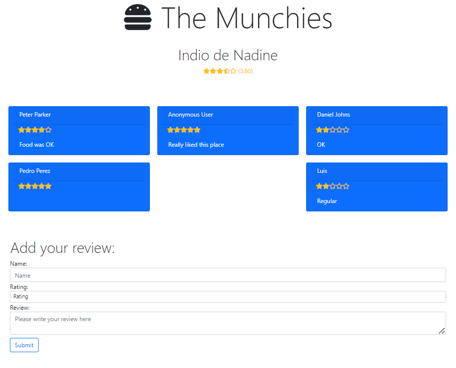
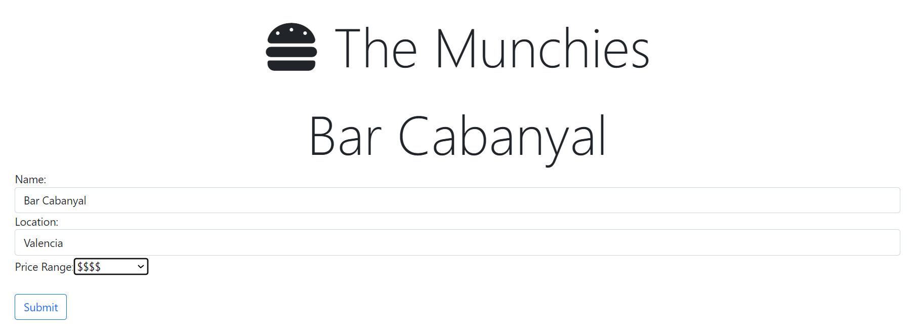

# The Munchies App

This is a Full stack application developed using Postgres, Express, React and Node.js (PERN stack). 
The main purpose for working on this project was to develop confidence on connecting the front and back ends.

It was based on a Youtube tutorial by [freeCodeCamp.org](https://www.freecodecamp.org/) called [PERN Stack Course - Build a Yelp clone](https://www.youtube.com/watch?v=J01rYl9T3BU&t=21401s) which I've tweaked a few things which, 
in my opinion, needed some improvement. For example, making it a single page application and making better use of the useEffect Hook.

The most important addition to this project, which will be available on a next version, is to include user authentication. 

You can check a live version of the app running in Heroku [in this link](http://the-munchies.herokuapp.com/).

## How to install and run the project locally
_In order to run this project you must have Node.js and PostgreSQL installed.

1. Clone the project
2. Run `npm install` in order to get all dependencies
```
npm install
```
3. Open the `db.sql` file located in the root folder of the project and run the queries to copy the database locally
4. Run `npm run start` to start local server
```
npm run dev
```
5. On a different terminal run `npm heroku-postbuild` which will launch the client
```
npm heroku-postbuild
```

## App usage

- You can add a new restaurant to our database by filling the required info and click on the *add* button


- All restaurants will be listed at the bottom of the main page, information includes the *average rating* users have given to the restaurant.


- You can access the detailed restaurant information and reviews by clicking on the restaurant´s name on the list. In this page you´ll also have the option to add your review for the restaurant



- If you want to Update a restaurant´s information, click on the *update* button, which will for the update page with the selected restaurant information filled. Make changes required and click *submit*



- If you want to delete a restaurant from the list, just click the *delete* button on the restaurant list.

## License and Copyright

MIT License

Copyright (c) [2022] [Luis José Gonzalez]

Permission is hereby granted, free of charge, to any person obtaining a copy
of this software and associated documentation files (the "Software"), to deal
in the Software without restriction, including without limitation the rights
to use, copy, modify, merge, publish, distribute, sublicense, and/or sell
copies of the Software, and to permit persons to whom the Software is
furnished to do so, subject to the following conditions:

The above copyright notice and this permission notice shall be included in all
copies or substantial portions of the Software.

THE SOFTWARE IS PROVIDED "AS IS", WITHOUT WARRANTY OF ANY KIND, EXPRESS OR
IMPLIED, INCLUDING BUT NOT LIMITED TO THE WARRANTIES OF MERCHANTABILITY,
FITNESS FOR A PARTICULAR PURPOSE AND NONINFRINGEMENT. IN NO EVENT SHALL THE
AUTHORS OR COPYRIGHT HOLDERS BE LIABLE FOR ANY CLAIM, DAMAGES OR OTHER
LIABILITY, WHETHER IN AN ACTION OF CONTRACT, TORT OR OTHERWISE, ARISING FROM,
OUT OF OR IN CONNECTION WITH THE SOFTWARE OR THE USE OR OTHER DEALINGS IN THE
SOFTWARE.
